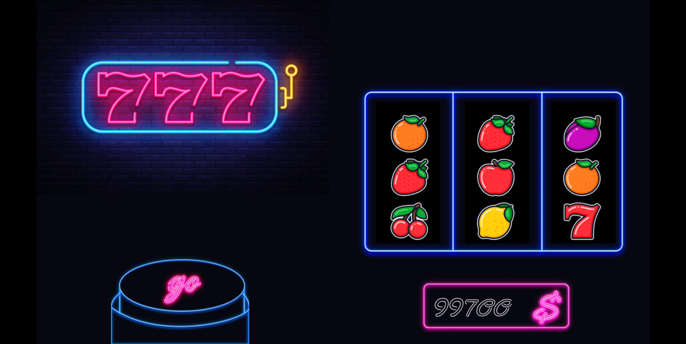

<h1 align="center">
  <br>
  <a href="https://github.com/yandeu/phaser-project-template#readme"></a>
  <br>
  Slot Machine
  <br>
</h1>

<h4 align="center">
A simple slot machine implementation done on <a href="https://phaser.io/" target="_blank" >Phaser 3</a> with <a href="https://www.typescriptlang.org/index.html" target="_blank" >TypeScript</a> and <a href="https://webpack.js.org/" target="_blank" >webpack</a></h4>

<p align="center">
  <a href="https://opensource.org/licenses/MIT" title="License: MIT" >
    
  </a>
  
  
  <a href="https://github.com/prettier/prettier" alt="code style: prettier"></a>
</p>

<p align="center">
  <a href="#preview">Preview</a> •
  <a href="#template-used">Template Used</a> •
  <a href="#how-to-use">How To Use</a> •
  <a href="#useful-links">Useful Links</a> •
  <a href="#credits">Credits</a> •
  <a href="#license">License</a>
</p>


---

## Preview

Once you clone the repository and run the below commands explained <a href="#how-to-use">here</a>, you will be greeted with the following screen:

<a href="https://s3.eu-central-1.amazonaws.com/phaser3-typescript/starter-template/index.html">

</a>

## Template
The project was built using this <a href="https://github.com/yandeu/phaser-project-template"> Template </a>

## How To Use

To clone and run this project, you'll need [Git](https://git-scm.com) and [Node.js](https://nodejs.org/en/download/) (which comes with [npm](http://npmjs.com)) installed on your computer. From your command line:

```bash
# Clone this repository (yes, npx not npm)
$ npx gitget oscariquelme01/slot-machine slot-machine

# Go into the repository
$ cd slot-machine

# Install dependencies
$ npm install

# Start the local development server (on port 8080)
$ npm start

# Ready for production?
# Build the production ready code to the /dist folder
$ npm run build

# Play your production ready game in the browser
$ npm run serve
```

## Useful Links

- [Phaser Website](https://phaser.io/)
- [Phaser 3 Forum](https://phaser.discourse.group/)
- [Phaser 3 API Docs](https://photonstorm.github.io/phaser3-docs/)
- [Official Phaser 3 Examples](http://labs.phaser.io/)
- [Notes of Phaser 3](https://rexrainbow.github.io/phaser3-rex-notes/docs/site/index.html)

## Credits

A huge thank you to Rich [@photonstorm](https://github.com/photonstorm) for creating Phaser

## License

The MIT License (MIT) 2021 - [Yannick Deubel](https://github.com/yandeu). Please have a look at the [LICENSE](LICENSE) for more details.
